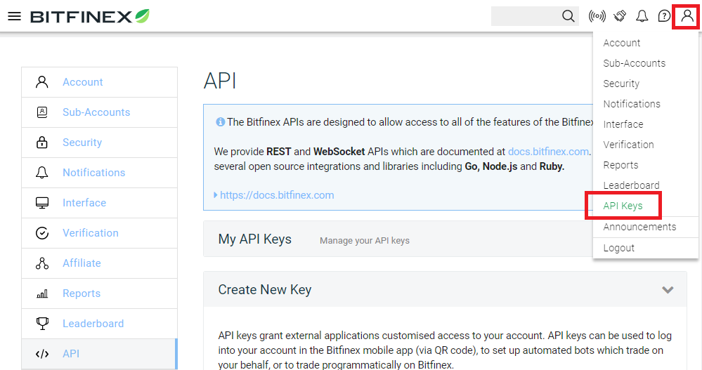
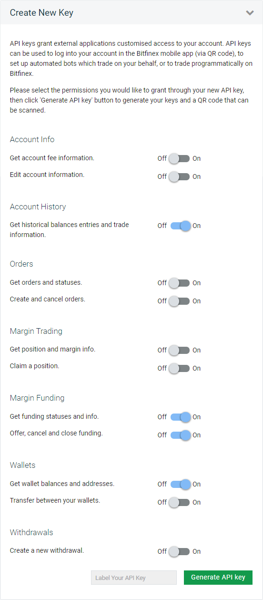
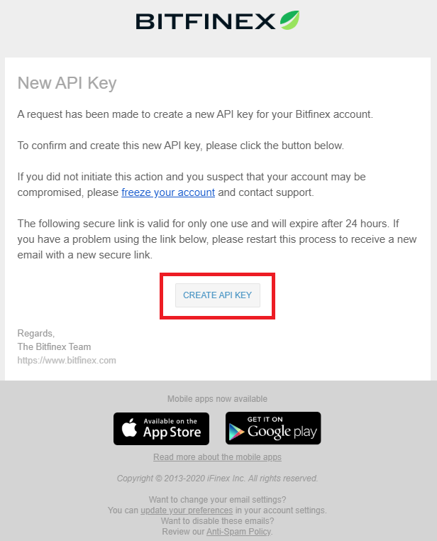
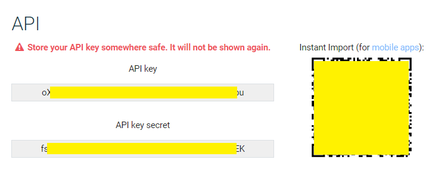

# Money Generator

Money generator is a semiautomatic bot to offer fundings on Bitfinex.

Two components are included: `bot-server` and `portal-server`.
Bot server will automatically create funding offers according to current market stats and your bot config.
Portal server provides a dashboard of monitors, reports and configuration to bot-server.


## Prerequisites

### Step up your Bitfinix API Key

1. Login Bitfinix and go to API keys page

    

2. Under `create new key` panel, setup permissions as following

    

3. Check following email and open the `CREATE API Key` link

    

4. Store both API key and API secret

    

## Deploy

``` bash
docker-compose -f docker-compose-prod.yaml up
```

Open portal in browser: `http://your-deploy-host:3000/?BITFINEX_API_KEY=<your-api-key>&BITFINEX_API_SECRET=<your-api-secret>`

## Develop

1. Install dependencies

    ``` bash
    yarn
    ```

2. Launch bot server

    ``` bash
    # for develop
    nodemon bot-server

    # for production
    yarn start-bot
    ```

3. Launch portal server

    ``` bash
    # for develop
    yarn dev

    # for production
    yarn build
    yarn start
    ```

4. Open portal in browser

    `http://your-dev-host:3000/?BITFINEX_API_KEY=<your-api-key>&BITFINEX_API_SECRET=<your-api-secret>`

## Reference

- <https://docs.bitfinex.com/reference>
- [bitfinex-api-node/docs/index.html](./node_modules/bitfinex-api-node/docs/index.html)
